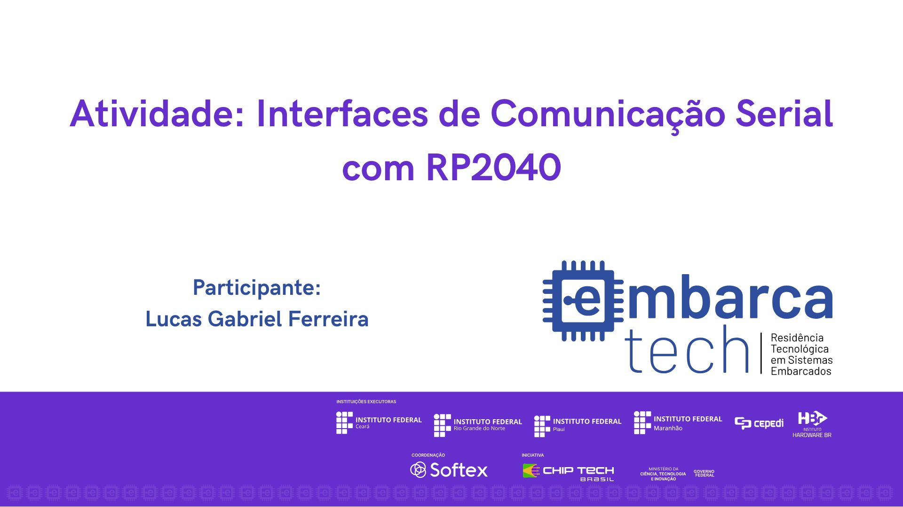

# EmbarcaTech_U4C6T1.

  

## Atividade: Introdução às Interfaces de Comunicação Serial com RP2040 UART, SPI e I2C

## Descrição do Projeto

Este projeto tem como objetivo consolidar a compreensão dos conceitos relacionados ao uso de interfaces de comunicação serial no microcontrolador RP2040 e explorar as funcionalidades da placa de desenvolvimento BitDogLab. Para isso, foram implementadas funcionalidades que envolvem manipulação de LEDs comuns, LEDs endereçáveis WS2812, botões com tratamento de bouncing via software, comunicação serial via UART e uso do display SSD1306 via protocolo I2C.

## Componentes Utilizados

- **Matriz de LEDs Coloridos (LED-RGB 5x5 WS2812)**: Para exibição das animações.
- **Microcontrolador Raspberry Pi Pico W (RP2040)**: Responsável pelo controle dos pinos GPIO.
- **LED RGB**: Com os pinos conectados às GPIOs 11, 12 e 13.
- **Botão A**: Conectado à GPIO 5.
- **Botão B**: Conectado à GPIO 6.
-**Display SSD1306**: Conectado via I2C nas GPIOs 14 e 15.

## Ambiente de Desenvolvimento

- **VS Code**: Ambiente de desenvolvimento utilizado para escrever e debugar o código.
- **Linguagem C**: Linguagem de programação utilizada no desenvolvimento do projeto.
- **Pico SDK**: Kit de Desenvolvimento de Software utilizado para programar a placa Raspberry Pi Pico W.
- **Simulador Wokwi**: Ferramenta de simulação utilizada para testar o projeto.

## Guia de Instalação

1. Clone o repositório:
2. Importe o projeto utilizando a extensão da Raspberry Pi.
3. Compile o código utilizando a extensão da Raspberry Pi.
4. Caso queira executar na placa BitDogLab, insira o UF2 na placa em modo bootsel.
5. Para a simulação, basta executar pela extensão no ambiente integrado do VSCode.

## Guia de Uso

O display SSD1306 exibirá os caracteres digitados no Serial Monitor e a matriz 5x5 WS2812 exibirá um símbolo correspondente quando um número (0-9) for digitado. O Botão A alternará o estado do LED Verde e registrará a ação no display e no Serial Monitor enquanto o Botão B alternará o estado do LED Azul e registrará a ação no display e no Serial Monitor.

## Testes

Testes básicos foram implementados para garantir que cada componente está funcionando corretamente. 

## Desenvolvedor

[Lucas Gabriel Ferreira](https://github.com/usuario-lider)

## Vídeo da Solução

Clique na imagem abaixo para assistir ao vídeo que demonstra a solução trabalhada e os resultados obtidos nos experimentos:

  

